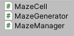
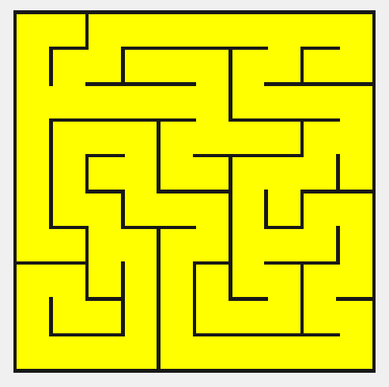
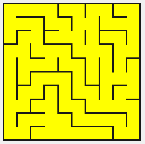
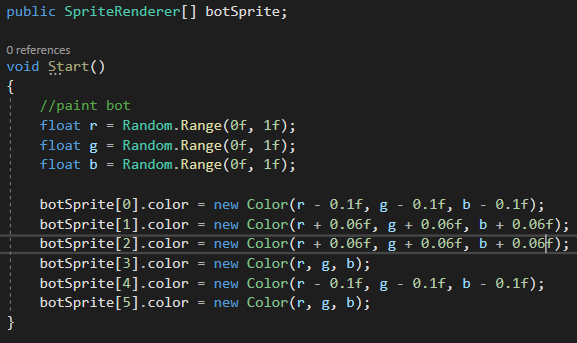
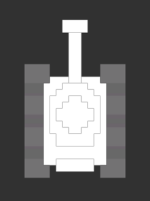
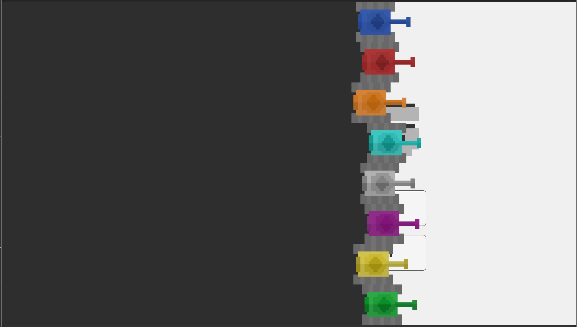
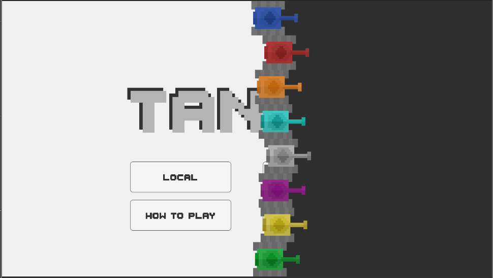
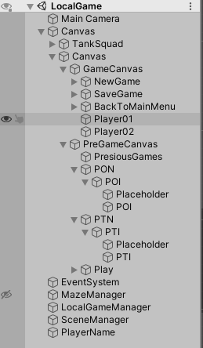
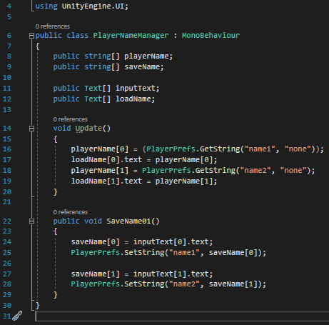

# __TanksGame__

This repository will contain all the files connected to my project, Tanks.

## __Description:__

The project started on 1.3.2022 and I work with the 2019.4.4f1 version von Unity.  

The game will consist of two gamemodes. First, a local one vs one. Second an online PvP with up to 10 players. In each of these a maze will be generated in which the players are spread out randomly. The players than have to navigate through the maze and shoot each other. The last man standing wins.

## __Progress__

Here are some rules I will apply to the Builds:

- XX.0.0. -> means something big happened like for example a new gamemode has been added or a playable version is created
- 0.XX.0. -> new things added to the game but not gamebreaking, for example new animations or not fully playable builds
- 0.0.XX. -> just some minor changes like bug fixes

Not all updates will be mentioned because they only exist for testing purpose and are insignificant otherwise. Only the complete version of an update will be noted. The version not mentioned here are still playable in the ./Tanks - Projekt/Builds/ folder. 

## __02.03.2022 - The Beginning__

I started with setting up the environment in Unity.
Also tried to make the first steps towards the maze generation. 
I decided on the recursive implementation but will change the way it works later on.

## __04.03.2022 - Maze Generation - 0.0.1__

# describe how the generator works in detail 

I used _Recursive Backtracking_ algorithm. For this I used three scripts: 

 
1. MazeCell.cs --> defines the walls (top, right, bottom, left), x and y coordinates, cell sprite and a boolean if the cell is visited or not.  
2. MazeGenerator.cs --> is responsible for the generation of the maze; carves path, sets edge walls.
3. MazeManager.cs --> starts and restart the MazeGenerator script

_A (almost) finished maze should look something like this:_

I still need to break some walls inbetween to create new paths. This maze generation will be just as larg as in the picture for the local games. For the PvP version I intend to make it 4 or 5 times larger.

_This is what a finished maze should look like:_

## __06.03.2022 - Main Menu - 0.1.1__

The main menu consists of a big title and some buttons, for now. To make it a bit more interessting I added bots that drive around in the background. They spawn outside of the field of view of the camera and start moving in one direction. not far from this zone is a death zone where these bots are destroyed to save resources. 

At spawn each bot gets its own random color.

SpriteRendere[] botSprite; refers to the different section of each bot.

 

The body of the tank is completelly white and the different sections like the barrel or the main body are separated into 6 pieces. Like this I can color each of the 6 sprites indevidually to give the bots some perosnality.

## __08.03.2022 - Scene Transitions - 0.1.5.1__

So to make the pace of the game smoother I made a little animation between scenes. A wall of sprites just like the player itself moves from left to right and leaves a dark background behind it. This indicates the end of a scene. At the start almost the same thing happens just with the dark screen going first and the wall of tanks after it.

_When the player exists a scene:_

_when the player enters a scene:_

## __XX.03.2022 - Local Game -__

I started working on the local game. When the player joins on the "Local Game" button in the main menu he/she will be sent to the LocalGame scene. Then a table will show up in which the last 10 or so game will be displayed with the players that played that game and their points. Below that two input fields for the player names and a Next button. The Next button leads to the actual game. The same maze that was already mentioned before will be generated here as well. 

### __Pregame Menu__

The first canvas the player sees is the PreGameCanvas that holds the score table ans is responsible for the player name input. 

 

In version 0.2.1 the player name input system is working. You can enter a name end it will show in the game canvas. 

### Game

## - How To Play - 

Here you can scroll through some pages and view what the game has to offer and how it works. First the basic stuff like movement, score and items. Next the extra stuff for the local game and after tha for the online game. 

My idea of visualising this  page would look something like this:

    (button left - previous) (content - the information) (button right - next)

    (# --- # --- # --- # --- tank sprite --- # --- # --- # --- # --- # --- #) 

where the --- represent a path and the # a stop where information will be shown.

# ideas for the future 
## local game
before starting the players get to choose names

these names will then be saved in localgames.db 

at the same time the previously played games will be displayed with tha 5 latest games: with it the names of the players and sroce as well 

## overall 

so to make the game more exciting i will ad a "lucky box" where you can get new weapons from. for example instead of shooting a regular shot you shoot 4 slighly smaller bullets aka a shotgun.
so on and so forth. i will still collet ideas but for now its just important to remember this

Weapons ideas:

- shotgun 
- laserbeam 
- item that makes you invulnerable for 1 second
- rapid fire (10 - 15 really small bullets)
- landmine 
- shrapnell bullet
- heavyshot 